<body style="
  background-color:#151d28; 
  color: #c7cfcc;  
  margin-top: 50px;
  margin-bottom: 50px;
  margin-right: 50px;
  margin-left: 50px;">

# Bouncee maths

## Linear

| Name      | Function                              | Domain                                            | Graph                            |
| --------- | ------------------------------------- | ------------------------------------------------- | -------------------------------- |
| In    | $f(x) = x$                            | $\{ 0 \le x \le 1\}$                              | 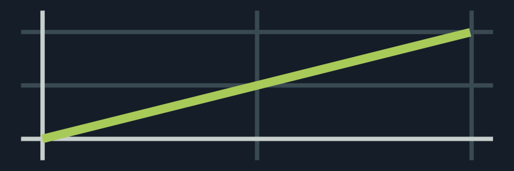 |
| Spike | $f(x) = 2 x$    $g(x) = 2 (1-x)$ | $\{ 0 \le x \le 0.5\}$   $\{0.5 < x \le 1\}$ | 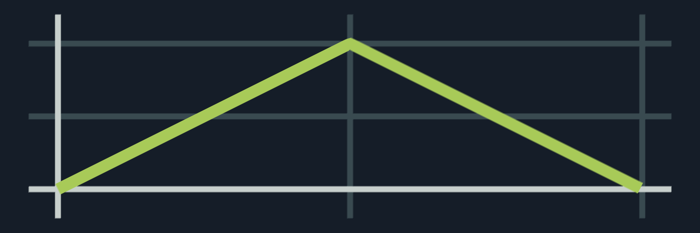 |

## Sinus

| Name      | Function                                                | Domain                                            | Graph                            |
| --------- | ------------------------------------------------------- | ------------------------------------------------- | -------------------------------- |
| In    | $f(x) = -cos (0.5x \pi) + 1$                            | $\{ 0 \le x \le 1\}$                              | 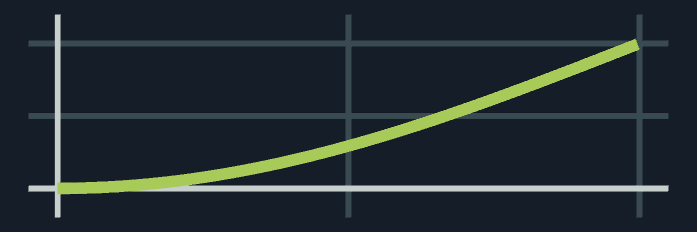 |
| Out   | $f(x) =  sin (0.5x \pi )$                               | $\{ 0 \le x \le 1\}$                              | 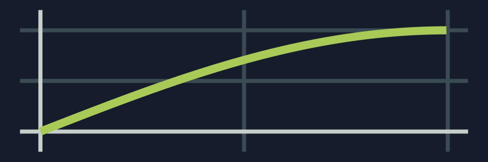 |
| InOut | $f(x) = -0.5 cos(x \pi) + 0.5$                          | $\{ 0 \le x \le 1\}$                              | 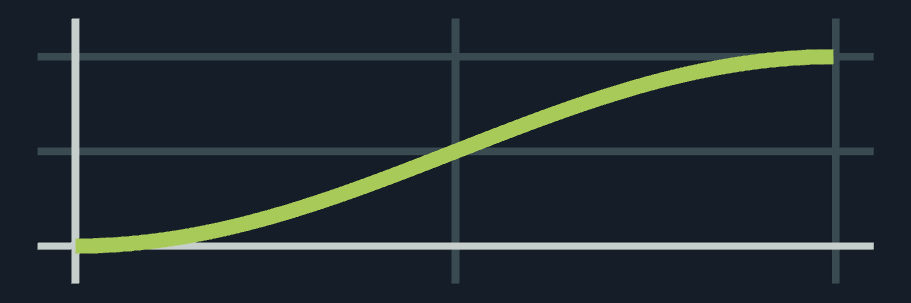 |
| Spike | $f(x) = -cos(x \pi) + 1$   $g(x) = cos(x \pi) + 1$ | $\{ 0 \le x \le 0.5\}$   $\{0.5 < x \le 1\}$ |  |

    

## Quadratic

| Name      | Function                                            | Domain                                            | Graph                             |
| --------- | --------------------------------------------------- | ------------------------------------------------- | --------------------------------- |
| In    | $f(x) = x^2$                                        | $\{ 0 \le x \le 1\}$                              | 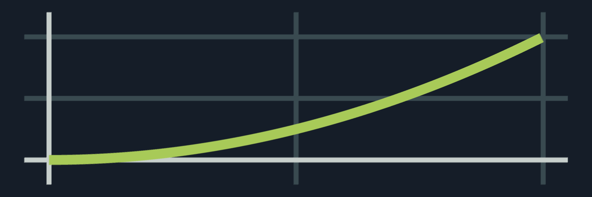  |
| Out   | $f(x) =  1 - (x - 1)^2$                             | $\{ 0 \le x \le 1\}$                              | 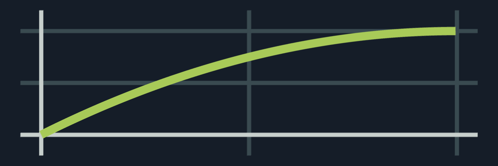  |
| InOut | $f(x) = 2 x^2$   $g(x) = 1 - 0.5 (2  x - 2)^2$ | $\{ 0 \le x \le 0.5\}$   $\{0.5 < x \le 1\}$ | 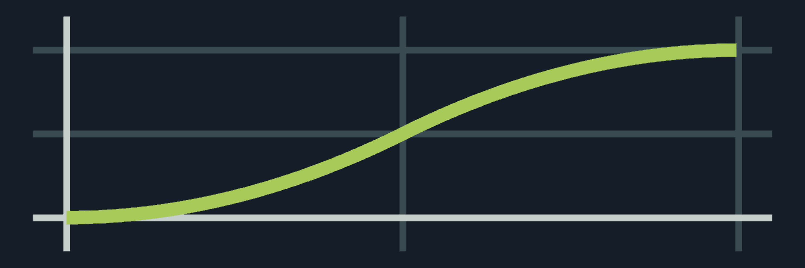 |
| Spike | $f(x) = 4 x^2$   $g(x) = (2  x - 2)^2$         | $\{ 0 \le x \le 0.5\}$   $\{0.5 < x \le 1\}$ | 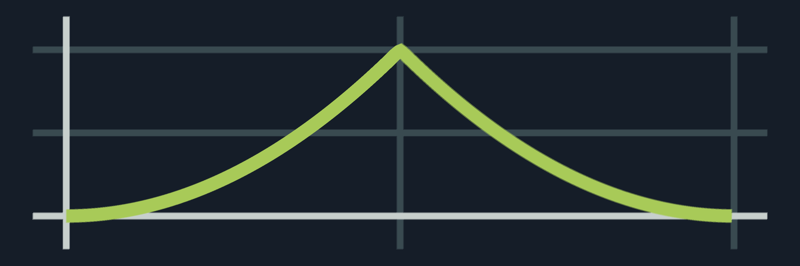 |

## Cubic

| Name      | Function                                       | Domain                                            | Graph                             |
| --------- | ---------------------------------------------- | ------------------------------------------------- | --------------------------------- |
| In    | $f(x) = x^3$                                   | $\{ 0 \le x \le 1\}$                              | 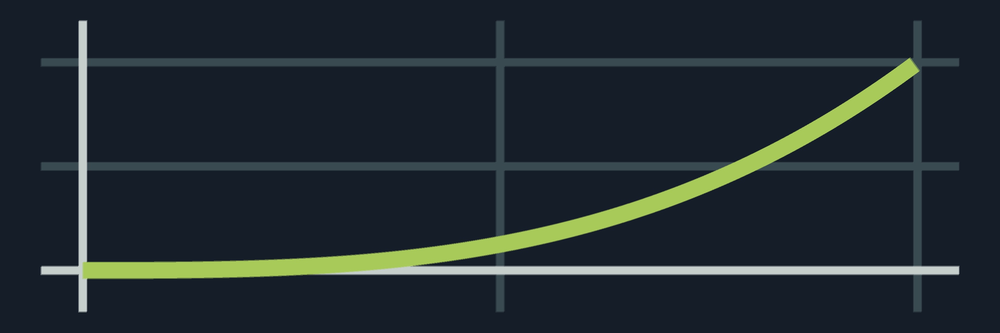 |
| Out   | $f(x) = 1 + (x - 1)^3$                         | $\{ 0 \le x \le 1\}$                              | 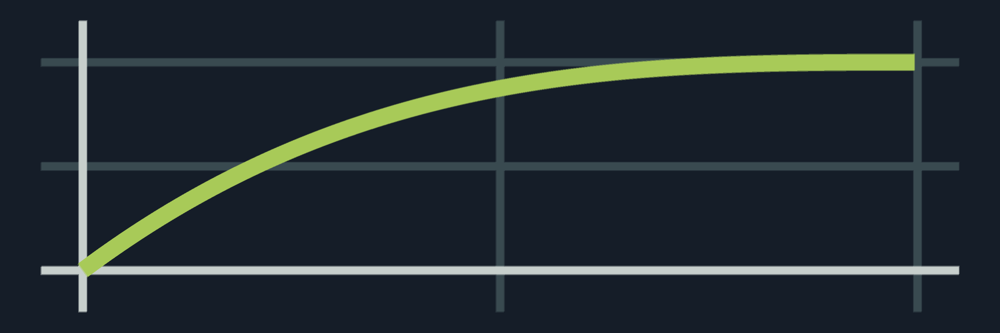 |
| InOut | $f(x) = 4 x^3$   $g(x) = 1 + 4 (x - 1)^3$ | $\{ 0 \le x \le 0.5\}$   $\{0.5 < x \le 1\}$ | 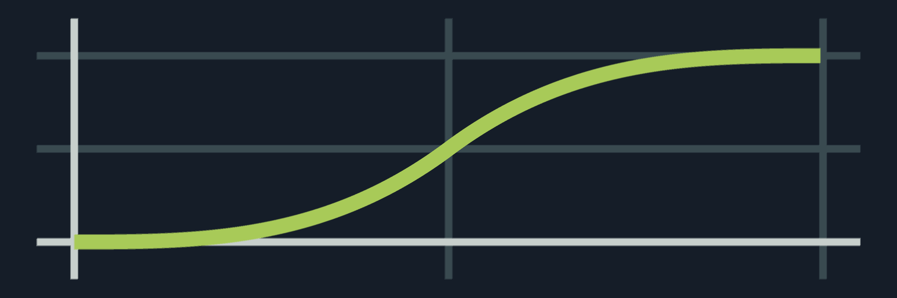 |
| Spike | $f(x) = 8 x^3$   $g(x) = -(2  x - 2)^3$   | $\{ 0 \le x \le 0.5\}$   $\{0.5 < x \le 1\}$ | 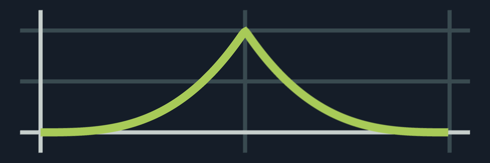 |

    

## Quartic

| Name      | Function                                                         | Domain                                            | Graph                             |
| --------- | ---------------------------------------------------------------- | ------------------------------------------------- | --------------------------------- |
| In    | $f(x) = x^4$                                                     | $\{ 0 \le x \le 1\}$                              | 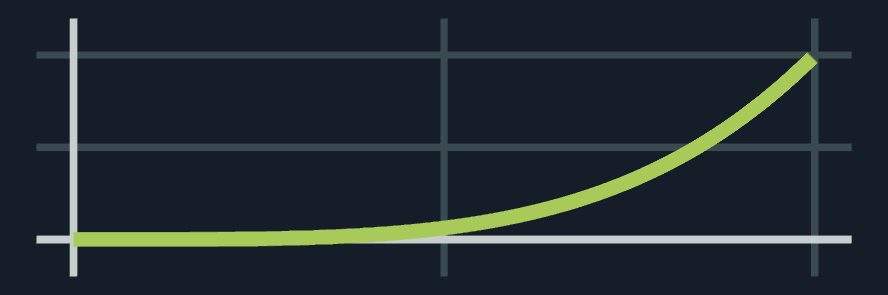 |
| Out   | $f(x) =  1 - (x - 1)^4$                                          | $\{ 0 \le x \le 1\}$                              | 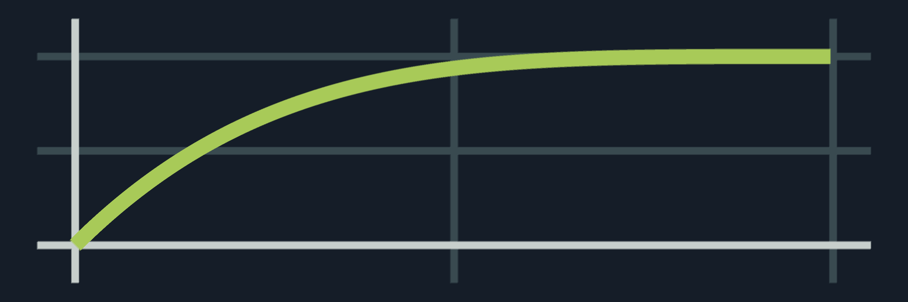 |
| InOut | $f(x) = 0.5 - 8 (x - 0.5)^4$   $g(x) = 0.5 + 8 (x - 0.5)^4$ | $\{ 0 \le x \le 0.5\}$   $\{0.5 < x \le 1\}$ | 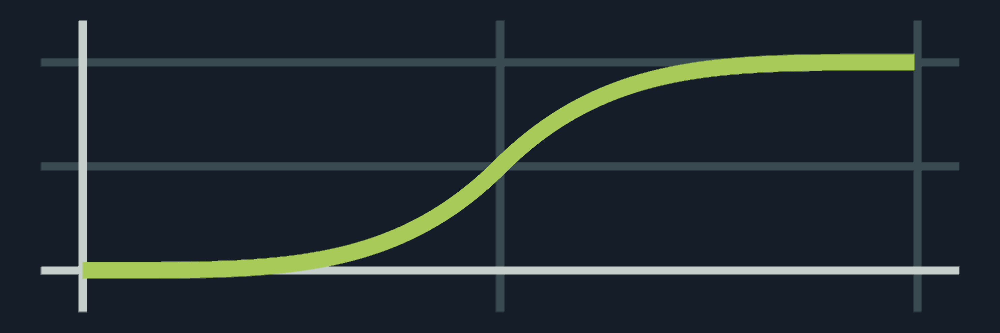 |
| Spike | $f(x) = 16 x^4$   $g(x) = (2  x - 2)^4$                     | $\{ 0 \le x \le 0.5\}$   $\{0.5 < x \le 1\}$ | 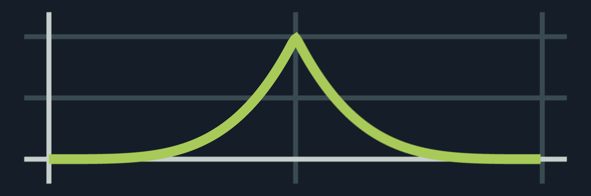 |

## Quintic

| Name      | Function                                         | Domain                                            | Graph                             |
| --------- | ------------------------------------------------ | ------------------------------------------------- | --------------------------------- |
| In    | $f(x) = x^5$                                     | $\{ 0 \le x \le 1\}$                              | 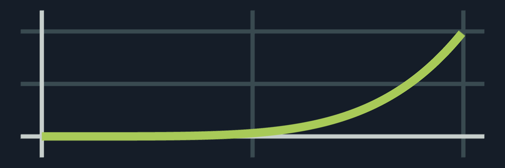 |
| Out   | $f(x) = 1 + (x - 1)^5$                           | $\{ 0 \le x \le 1\}$                              |  |
| InOut | $f(x) = 16 x^5$   $g(x) = 1 + 16 (x - 1)^5$ | $\{ 0 \le x \le 0.5\}$   $\{0.5 < x \le 1\}$ | 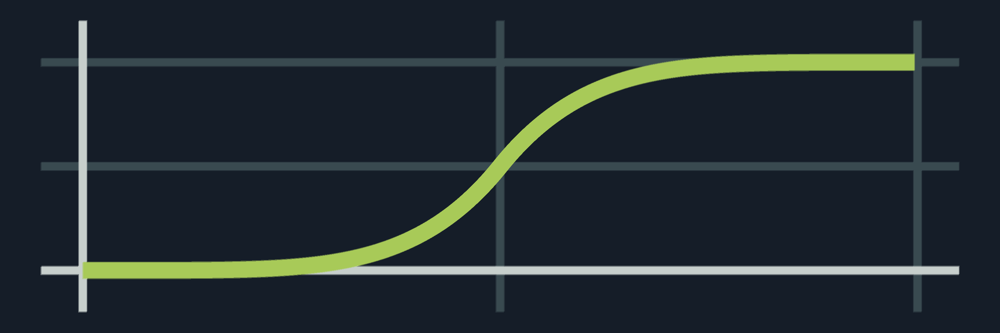 |
| Spike | $f(x) = 32 x^5$   $g(x) = -(2  x - 2)^5$    | $\{ 0 \le x \le 0.5\}$   $\{0.5 < x \le 1\}$ | 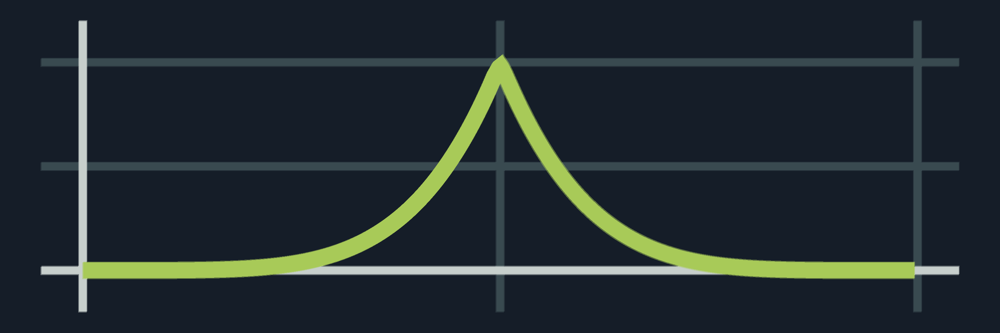 |

    

## Exponential

| Name      | Function                                                                  | Domain                                            | Graph                             |
| --------- | ------------------------------------------------------------------------- | ------------------------------------------------- | --------------------------------- |
| In    | $f(x) = 1 - \sqrt{ 1 - x}$                                                | $\{ 0 \le x \le 1\}$                              | 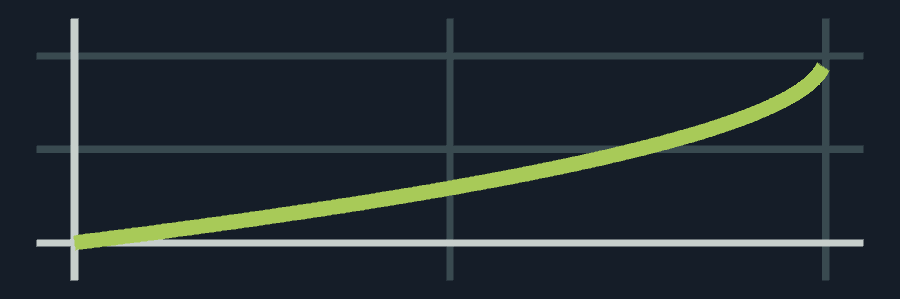 |
| Out   | $f(x) = \sqrt{x}$                                                         | $\{ 0 \le x \le 1\}$                              | 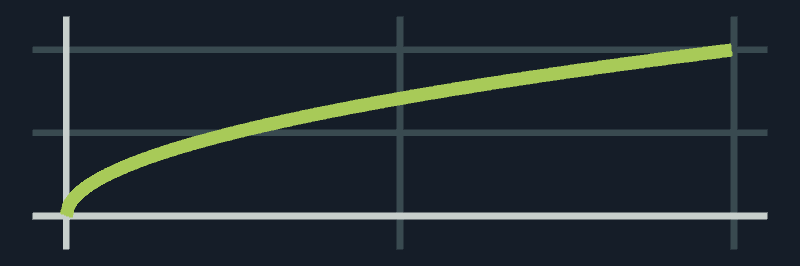 |
| InOut | $f(x) = 0.5 - 0.5 \sqrt{1 - 2 x}$   $g(x) = 0.5 + 0.5 \sqrt{2x - 1}$ | $\{ 0 \le x \le 0.5\}$   $\{0.5 < x \le 1\}$ | 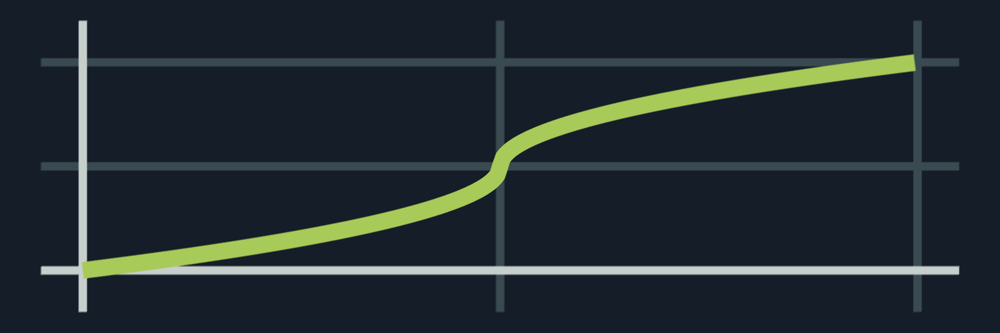 |
| Spike | $f(x) = 1 - \sqrt{1 - 2 x}$   $g(x) = 1 + \sqrt{2x - 1}$             | $\{ 0 \le x \le 0.5\}$   $\{0.5 < x \le 1\}$ | 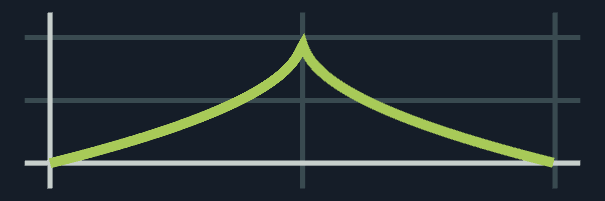 |

## Circular

| Name      | Function                                                                       | Domain                                            | Graph                             |
| --------- | ------------------------------------------------------------------------------ | ------------------------------------------------- | --------------------------------- |
| In    | $f(x) = 1 - \sqrt{ 1 - x^2}$                                                   | $\{ 0 \le x \le 1\}$                              | 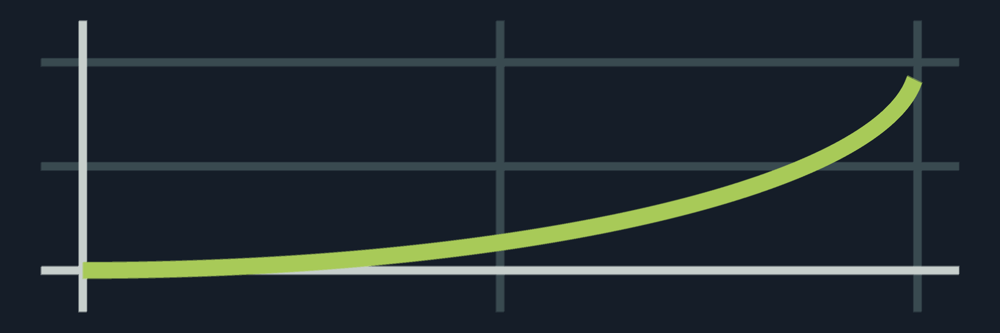 |
| Out   | $f(x) = \sqrt{ 1 - (x - 1)^2}$                                                 | $\{ 0 \le x \le 1\}$                              | 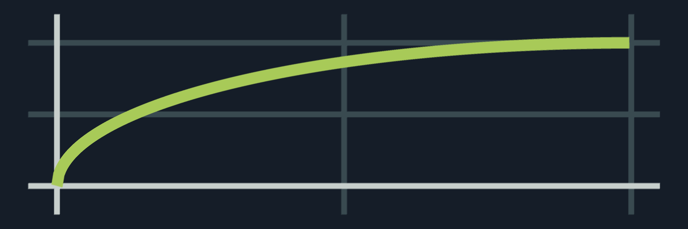 |
| InOut | $f(x) = 0.5 - \sqrt{0.25 - x^2}$   $g(x) = 0.5 + \sqrt{0.25 - (x - 1)^2}$ | $\{ 0 \le x \le 0.5\}$   $\{0.5 < x \le 1\}$ | 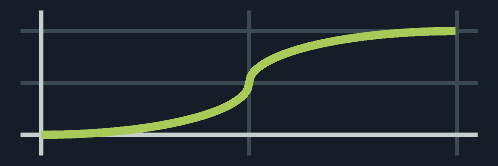 |
| Spike | $f(x) = 1 - \sqrt{1 - 4x^2}$   $g(x) = 1 - \sqrt{2x - 2}^2$               | $\{ 0 \le x \le 0.5\}$   $\{0.5 < x \le 1\}$ | 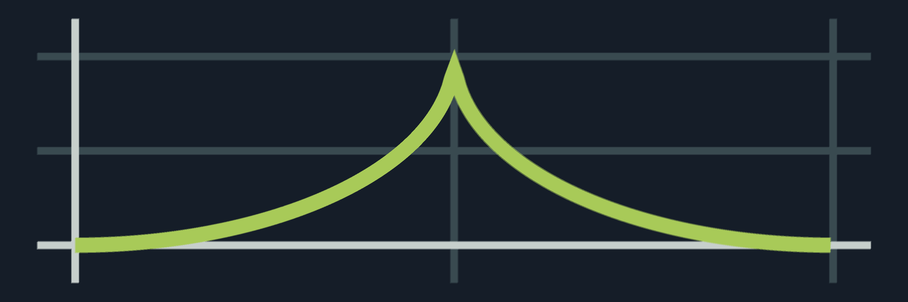 |

    

## Bounce

s = 7.5625 (scalar that narrows parabola)  
d = 2.75 (offset on the x axis)

| Name      | Function                                                                                                                                                                                                                                                                                                                                                                                                                                                                                                                                | Domain                                                                                                                                                                                                                                                                                                                                                       | Graph                             |
| --------- | --------------------------------------------------------------------------------------------------------------------------------------------------------------------------------------------------------------------------------------------------------------------------------------------------------------------------------------------------------------------------------------------------------------------------------------------------------------------------------------------------------------------------------------- | ------------------------------------------------------------------------------------------------------------------------------------------------------------------------------------------------------------------------------------------------------------------------------------------------------------------------------------------------------------ | --------------------------------- |
| In    | $f(x) = 1 - sx^2$ $g(x) = 1 - s(x - \frac{1.5}{d})^2 - 0.75$ $h(x) = 1 - s(x - \frac{2.25}{d})^2 -$ $- 0.9375$   $i(x) = 1 - s(x - \frac{2.625}{d})^2 -$   $- 0.984375$                                                                                                                                                                                                                                                                                                                                        | $\{ 0 \le x < \frac{1}{d}\}$    $\{ \frac{1}{d} \le x < \frac{2}{d}\}$    $\{ \frac{2}{d} \le x < \frac{5}{4d}\}$     $\{ \frac{5}{4d} \le x < 1\}$                                                                                                                                                                            | 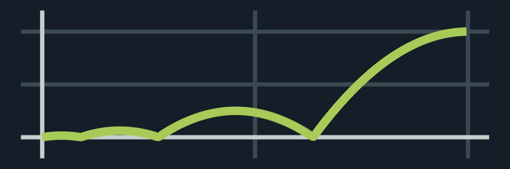 |
| Out   | $f(x) = sx^2$   $g(x) = s(x -\frac{1.5}{d})^2 - 0.75$   $h(x) = s(x - \frac{2.25}{d})^2 - 0.9375$   $i(x) = s(x - \frac{2.625}{d})^2 - 0.984375$                                                                                                                                                                                                                                                                                                                                                                         | $\{ 0 \le x < \frac{1}{d}\}$    $\{ \frac{1}{d} \le x < \frac{2}{d}\}$    $\{ \frac{2}{d} \le x < \frac{5}{4d}\}$    $\{ \frac{5}{4d} \le x < 1\}$                                                                                                                                                                                            | 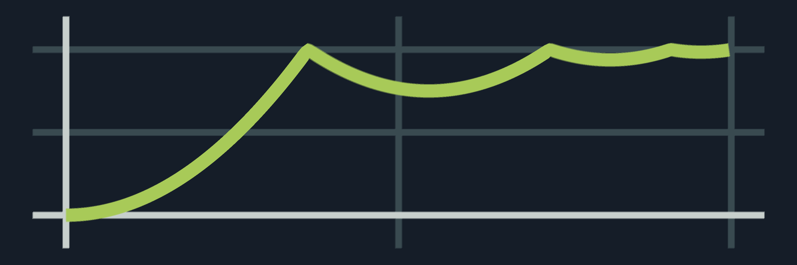 |
| InOut | $f(x) = (1 - (s( 1 - 2x - \frac{2.625}{d})^2 +$  $+ 0.984375)) / 2$   $g(x) = (1 - (s( 1 - 2x - \frac{2.5}{d})^2 +$ $+ 0.9375)) / 2$   $h(x) = (1 - (s( 1 - 2x - \frac{1.5}{d})^2 + 0.75)) / 2$   $i(x) = (1 - (s( 1 - 2x)^2)) / 2$   $j(x) = (0.5 + (s( 1 - 2x)^2)) / 2$   $k(x) = (0.5 + (s( 1 - 2x - \frac{1.5}{d})^2 + 0.75)) / 2$   $l(x) = (0.5 + (s(1 - 2x - \frac{2.5}{d})^2 +$ $+ 0.9375)) / 2$   $m(x) = (0.5 + (s( 1 - 2x - \frac{2.625}{d})^2 +$ $+ 0.984375)) / 25$ | $\{ 0 \le x < \frac{1}{2d}\}$     $\{ \frac{1}{2d} \le x < \frac{1}{d}\}$     $\{ \frac{1}{d} \le x < d\}$    $\{ d \le x < \frac{2}{d}\}$    $\{ \frac{2}{d} \le x < \frac{5}{4d}\}$    $\{ \frac{5}{4d} \le x < \frac{5}{2d}\}$   $\{ \frac{5}{2d} \le x < 0.5\}$     $\{ 0.5 \le x < 1\}$     |  |
| Spike | $f(x) = 1 - (s( 1 - 2x - \frac{2.625}{d})^2 +$  $+ 0.984375)$   $g(x) = 1 - (s( 1 - 2x - \frac{2.5}{d})^2 +$ $+ 0.9375)$   $h(x) = 1 - (s( 1 - 2x - \frac{1.5}{d})^2 + 0.75)$   $i(x) = 1 - (s( 1 - 2x)^2)$   $j(x) = 1 - (s( 1 - 2(1 - x) - \frac{1.5}{d})^2 + 0.75))$   $k(x) = 1 - (s(1 - 2(1 - x) - \frac{2.5}{d})^2 +$ $+ 0.9375))$   $l(x) = 1 - (s( 1 - 2(1 - x) - \frac{2.625}{d})^2 +$ $+ 0.984375)$                                                                         | $\{ 0 \le x < \frac{1}{2d}\}$     $\{ \frac{1}{2d} \le x < \frac{1}{d}\}$     $\{ \frac{1}{d} \le x < d\}$    $\{ d \le x < \frac{5}{4d}\}$    $\{ \frac{5}{4d} \le x < \frac{5}{4d}\}$    $\{ \frac{5}{4d} \le x < \frac{5}{2d}\}$    $\{ \frac{5}{2d} \le x < 0.5\}$     $\{ 0.5 \le x < 1\}$       | 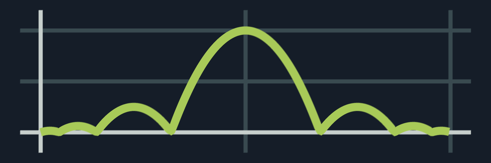 |

## Elastic
## Back
  
Polynomial shaping:
## Inverted Cos
## Double Cubic
## Double Cubic Blend
## Double Odd

</body>